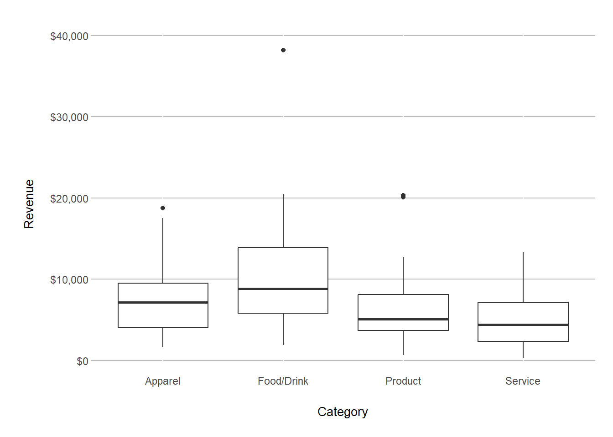
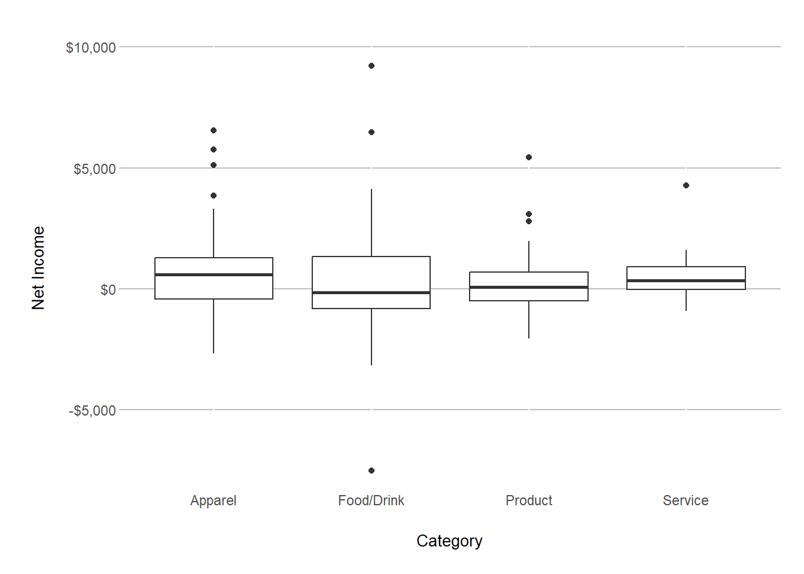

::: {.cell}

```{.r .cell-code}
library(tidyverse)
library(directlabels)
library(ggrepel)
library(gapminder)
library(ggthemes)
library(scales)

data <- read_csv("C:\\Users\\derek\\OneDrive - BYU-Idaho\\Documents\\Data Science Society\\IBC Historical Data.csv")
```
:::

::: {.cell}

```{.r .cell-code}
per_dec <- function(x) {
  numeric_values <- as.numeric(gsub("%", "", x))
  
  numeric_values / 100
}
```
:::

::: {.cell}

```{.r .cell-code}
ibc <- data %>% 
  mutate(
    `Gross Margin` = per_dec(data$`Gross Margin`), 
    `Net Income Margin` = per_dec(data$`Net Income Margin`))

ibc <- ibc[-c(1, 5, 7:10, 12:21), ]

ibc <- rename(ibc, net_income = "Net Income")

ibc_semester <- ibc %>% 
  group_by(Smstr)

ibc_semester$Smstr <- factor(ibc_semester$Smstr, levels = c("Fall", "Winter", "Spring"))

ibc_category <- ibc %>% 
  group_by(Category)

ibc_year <- ibc %>% 
  group_by(Year)
```
:::


## Revenue vs. Semester


::: {.cell}

```{.r .cell-code}
semester_aov <- aov(Revenue ~ Smstr, ibc_semester)
summary(semester_aov)
```

::: {.cell-output .cell-output-stdout}

```
             Df    Sum Sq  Mean Sq F value Pr(>F)
Smstr         2 6.578e+07 32890323   1.184  0.308
Residuals   186 5.167e+09 27779127               
```


:::

```{.r .cell-code}
par(mfrow = c(1,2))
plot(semester_aov, which = 1:2)
```

::: {.cell-output-display}
{width=672}
:::
:::

::: {.cell}

```{.r .cell-code}
ggplot(ibc_semester, aes(x=Smstr, y=Revenue)) +
  geom_boxplot() +
  labs(x="Semester", y="Revenue") +
  scale_y_continuous(labels = dollar_format()) +
  theme(plot.margin = unit(c(2,1,2,2), "lines"), 
        plot.title = element_text(hjust = 0.5, vjust = 6, face = 'bold'),  
        panel.background = element_rect(fill = "white"), 
        axis.ticks.length.x = unit(0, 'pt'),  
        axis.ticks.length.y = unit(0, 'pt'), 
        panel.grid.major.y = element_line(color = "grey", linetype = 'solid'),
        axis.title.y = element_text(vjust = 6, size = 10), 
        axis.title.x = element_text(vjust = -6, size = 10))
```

::: {.cell-output-display}
{width=672}
:::
:::


## Net Income vs. Semester


::: {.cell}

```{.r .cell-code}
seminc.aov <- aov(net_income ~ Smstr, ibc_semester)
summary(seminc.aov)
```

::: {.cell-output .cell-output-stdout}

```
             Df    Sum Sq Mean Sq F value Pr(>F)
Smstr         2  12835887 6417943   1.931  0.148
Residuals   186 618074756 3322983               
```


:::

```{.r .cell-code}
par(mfrow = c(1,2))
plot(seminc.aov, which = 1:2)
```

::: {.cell-output-display}
{width=672}
:::
:::

::: {.cell}

```{.r .cell-code}
ggplot(ibc_semester, aes(x=Smstr, y=net_income)) +
  geom_boxplot() +
  labs(x="Semester", y="Net Income") +
  scale_y_continuous(labels = dollar_format()) +
  theme(plot.margin = unit(c(2,1,2,2), "lines"), 
        plot.title = element_text(hjust = 0.5, vjust = 6, face = 'bold'),  
        panel.background = element_rect(fill = "white"), 
        axis.ticks.length.x = unit(0, 'pt'),  
        axis.ticks.length.y = unit(0, 'pt'), 
        panel.grid.major.y = element_line(color = "grey", linetype = 'solid'),
        axis.title.y = element_text(vjust = 6, size = 10), 
        axis.title.x = element_text(vjust = -6, size = 10))
```

::: {.cell-output-display}
{width=672}
:::
:::


## Revenue vs. Category


::: {.cell}

```{.r .cell-code}
cat_aov <- aov(Revenue ~ Category, ibc_category)
summary(cat_aov)
```

::: {.cell-output .cell-output-stdout}

```
             Df    Sum Sq   Mean Sq F value   Pr(>F)    
Category      3 4.901e+08 163354136   6.372 0.000392 ***
Residuals   185 4.743e+09  25635869                     
---
Signif. codes:  0 '***' 0.001 '**' 0.01 '*' 0.05 '.' 0.1 ' ' 1
```


:::

```{.r .cell-code}
par(mfrow = c(1,2))
plot(cat_aov, which = 1:2)
```

::: {.cell-output-display}
{width=672}
:::
:::

::: {.cell}

```{.r .cell-code}
ggplot(ibc_category, aes(x=Category, y=Revenue)) +
  geom_boxplot() +
  labs(x="Category", y="Revenue") +
  scale_y_continuous(labels = dollar_format()) +
  theme(plot.margin = unit(c(2,1,2,2), "lines"), 
        plot.title = element_text(hjust = 0.5, vjust = 6, face = 'bold'),  
        panel.background = element_rect(fill = "white"), 
        axis.ticks.length.x = unit(0, 'pt'),  
        axis.ticks.length.y = unit(0, 'pt'), 
        panel.grid.major.y = element_line(color = "grey", linetype = 'solid'),
        axis.title.y = element_text(vjust = 6, size = 10), 
        axis.title.x = element_text(vjust = -6, size = 10))
```

::: {.cell-output-display}
{width=672}
:::
:::


## Net Income vs. Category


::: {.cell}

```{.r .cell-code}
catin.aov <- aov(net_income ~ Category, ibc_category)
summary(catin.aov)
```

::: {.cell-output .cell-output-stdout}

```
             Df    Sum Sq Mean Sq F value Pr(>F)
Category      3  11239667 3746556   1.119  0.343
Residuals   185 619670977 3349573               
```


:::

```{.r .cell-code}
par(mfrow = c(1,2))
plot(catin.aov, which = 1:2)
```

::: {.cell-output-display}
{width=672}
:::
:::

::: {.cell}

```{.r .cell-code}
ggplot(ibc_category, aes(x=Category, y=net_income)) +
  geom_boxplot() +
  labs(x="Category", y="Net Income") +
  scale_y_continuous(labels = dollar_format()) +
  theme(plot.margin = unit(c(2,1,2,2), "lines"), 
        plot.title = element_text(hjust = 0.5, vjust = 6, face = 'bold'),  
        panel.background = element_rect(fill = "white"), 
        axis.ticks.length.x = unit(0, 'pt'),  
        axis.ticks.length.y = unit(0, 'pt'), 
        panel.grid.major.y = element_line(color = "grey", linetype = 'solid'),
        axis.title.y = element_text(vjust = 6, size = 10), 
        axis.title.x = element_text(vjust = -6, size = 10))
```

::: {.cell-output-display}
{width=672}
:::
:::

::: {.cell}

```{.r .cell-code}
ggplot(ibc_year, aes(x=Year, y=Revenue, group=Year)) +
  geom_boxplot() +
  labs(x="Year", y="Revenue") +
  scale_y_continuous(labels = dollar_format()) +
  theme(plot.margin = unit(c(2,1,2,2), "lines"), 
        plot.title = element_text(hjust = 0.5, vjust = 6, face = 'bold'),  
        panel.background = element_rect(fill = "white"), 
        axis.ticks.length.x = unit(0, 'pt'),  
        axis.ticks.length.y = unit(0, 'pt'), 
        panel.grid.major.y = element_line(color = "grey", linetype = 'solid'),
        axis.title.y = element_text(vjust = 6, size = 10), 
        axis.title.x = element_text(vjust = -6, size = 10))
```

::: {.cell-output-display}
{width=672}
:::
:::

::: {.cell}

```{.r .cell-code}
cogs <- ibc %>% 
  drop_na(COGS, net_income)

ibc_lm <- lm(net_income ~ COGS, data=cogs)
summary(ibc_lm)
```

::: {.cell-output .cell-output-stdout}

```

Call:
lm(formula = net_income ~ COGS, data = cogs)

Residuals:
    Min      1Q  Median      3Q     Max 
-8035.9  -931.5   -50.3   734.9  6130.4 

Coefficients:
              Estimate Std. Error t value Pr(>|t|)    
(Intercept) -407.29678  209.78081  -1.942   0.0537 .  
COGS           0.24913    0.05027   4.956 1.62e-06 ***
---
Signif. codes:  0 '***' 0.001 '**' 0.01 '*' 0.05 '.' 0.1 ' ' 1

Residual standard error: 1727 on 185 degrees of freedom
Multiple R-squared:  0.1172,	Adjusted R-squared:  0.1124 
F-statistic: 24.56 on 1 and 185 DF,  p-value: 1.619e-06
```


:::

```{.r .cell-code}
par(mfrow=c(1,3))
plot(ibc_lm,which=1:2)
plot(ibc_lm$residuals)
```

::: {.cell-output-display}
{width=672}
:::
:::

::: {.cell}

```{.r .cell-code}
ggplot(cogs, aes(x = COGS, y = net_income))+
  geom_point()+
  geom_smooth(method = lm, formula = y~x, se = FALSE)
```

::: {.cell-output-display}
{width=672}
:::
:::
