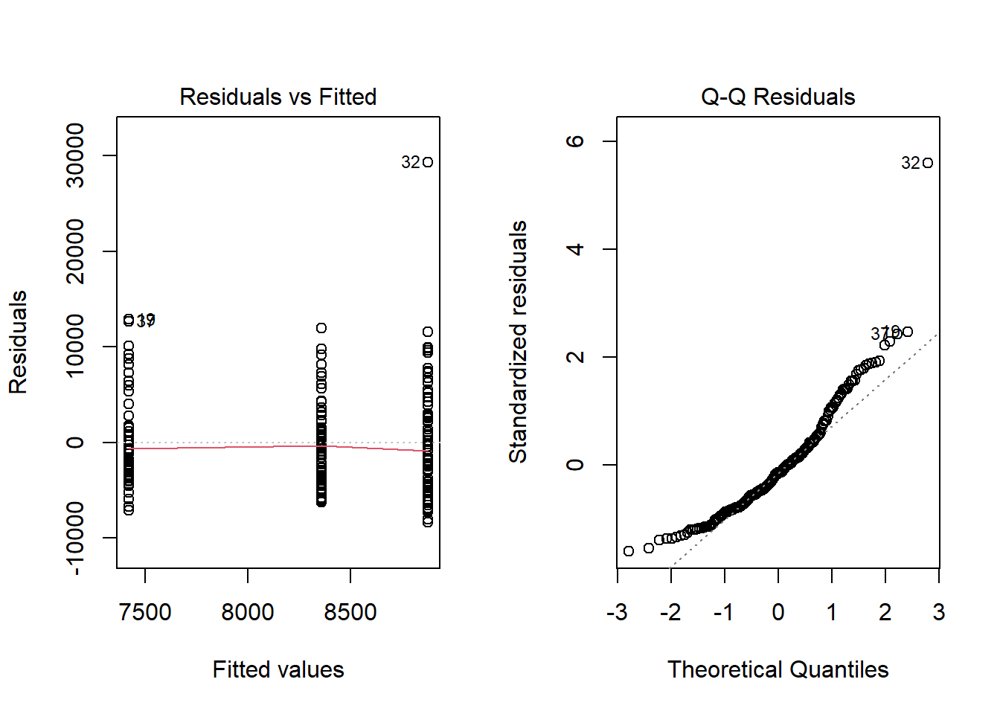
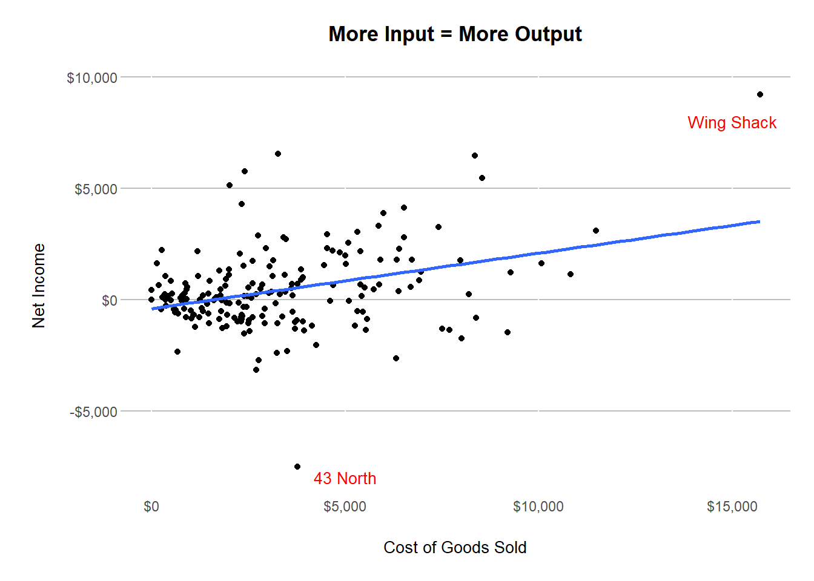
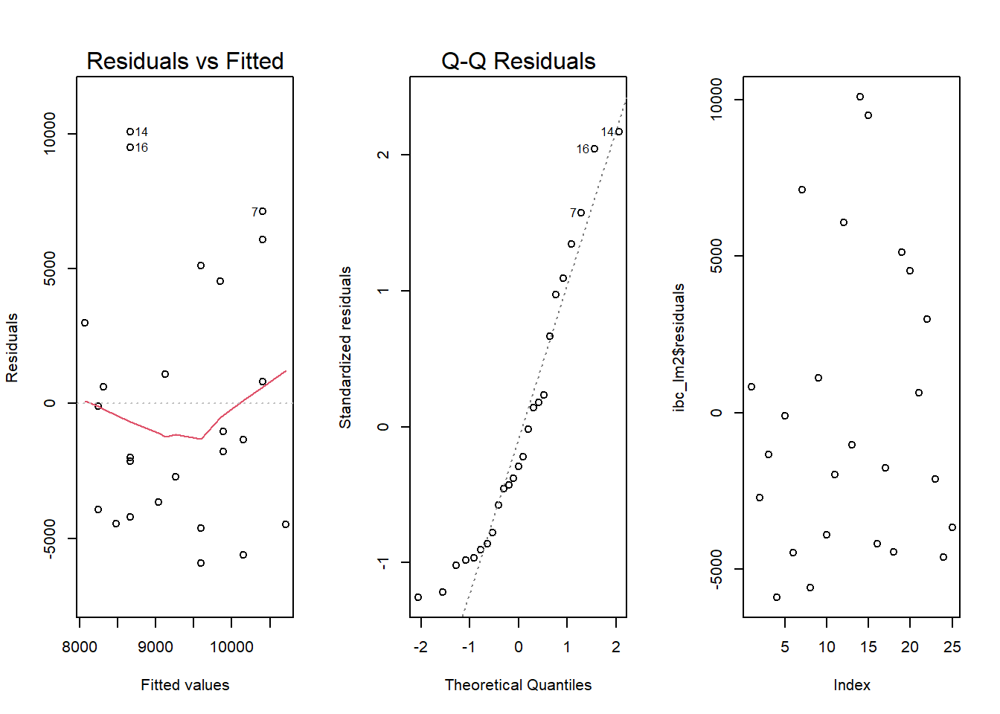
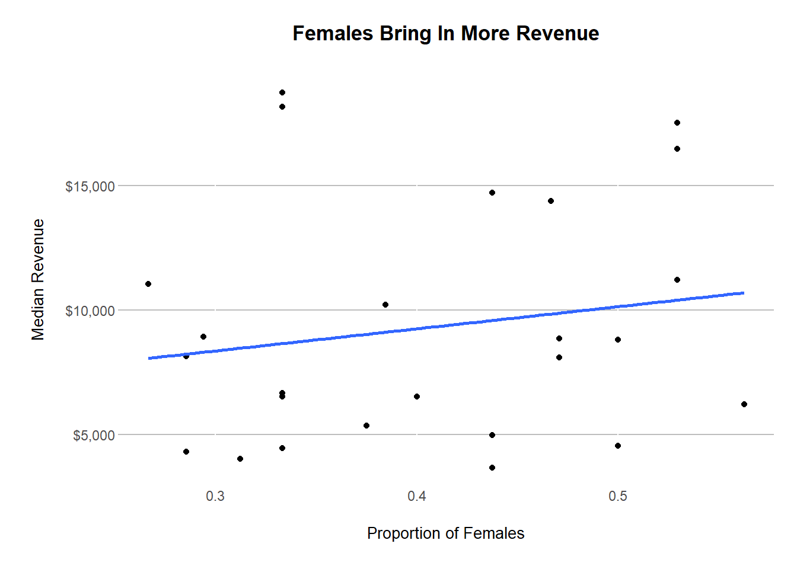
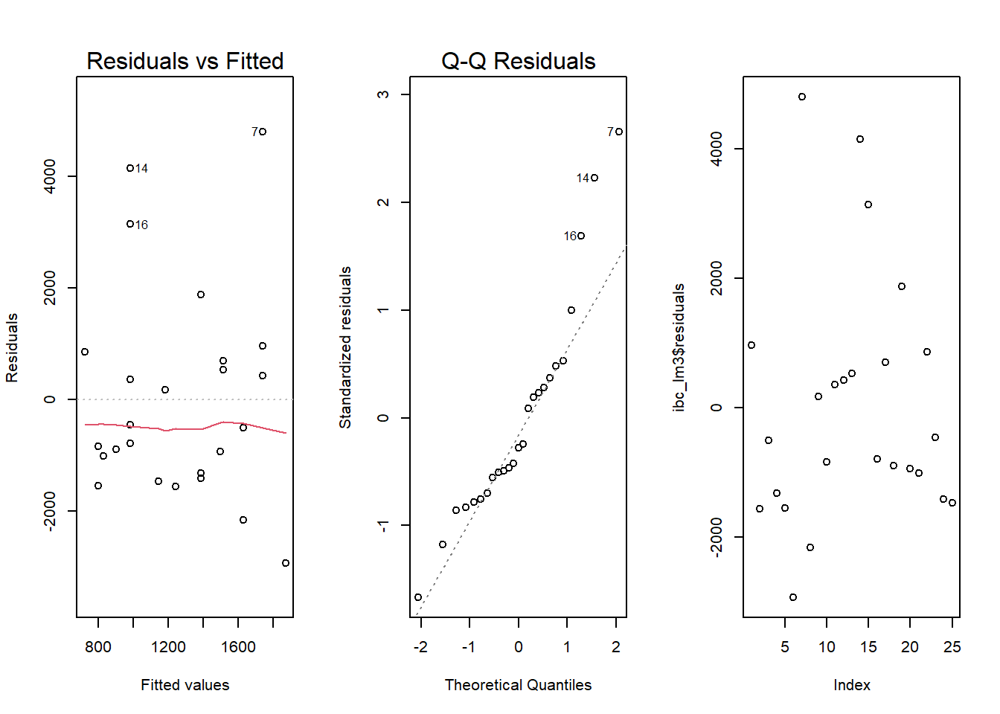
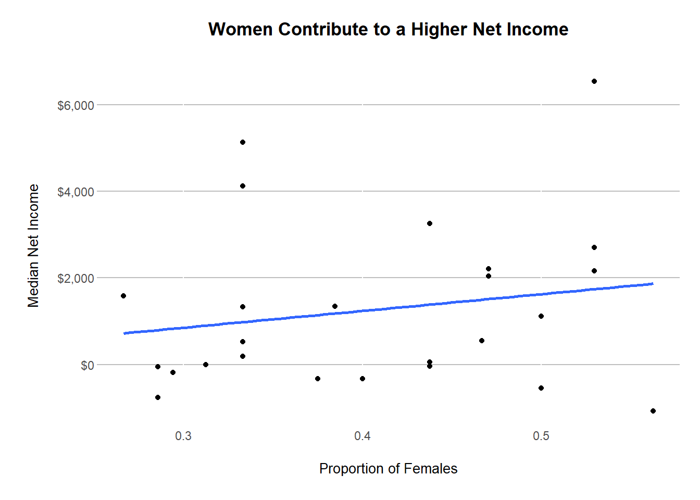

::: {.cell}

```{.r .cell-code}
library(tidyverse)
library(directlabels)
library(ggrepel)
library(gapminder)
library(ggthemes)
library(scales)
library(plotly)
library(pander)

data <- read_csv("C:\\Users\\derek\\OneDrive - BYU-Idaho\\Documents\\Data Science Society\\IBC Historical Data.csv")
```
:::

::: {.cell}

```{.r .cell-code}
per_dec <- function(x) {
  numeric_values <- as.numeric(gsub("%", "", x))
  
  numeric_values / 100
}
```
:::

::: {.cell}

```{.r .cell-code}
ibc <- data %>% 
  mutate(
    `Gross Margin` = per_dec(data$`Gross Margin`), 
    `Net Income Margin` = per_dec(data$`Net Income Margin`))

ibc <- ibc[-c(1, 5, 7:10, 12:21), ]

ibc <- rename(ibc, net_income = "Net Income")

ibc_semester <- ibc %>% 
  group_by(Smstr)

ibc_semester$Smstr <- factor(ibc_semester$Smstr, levels = c("Fall", "Winter", "Spring"))

ibc_category <- ibc %>% 
  group_by(Category)

ibc_year <- ibc %>% 
  group_by(Year)
```
:::


## Background

In the context of this statistical examination, we have set the threshold for statistical significance at an alpha level of 0.1. Upon conducting individual ANOVA analyses, we observe that the residuals versus fitted values plot demonstrates a consistent variance across each vertical cluster of data points. This is indicative of the homoscedasticity assumption being reasonably satisfied.

Furthermore, the Quantile-Quantile (Q-Q) Plot exhibits a reasonable degree of normality, although some deviations are noted at the extremities. This warrants a degree of caution in interpreting the results.

For illustrative purposes, we will provide one such assumption plot as a representative example. However, it is important to note that the pattern observed is generally consistent across all ANOVA analyses conducted.

## Individual Analysis

### Semester vs. Revenue


::: {.cell}

```{.r .cell-code}
semester_aov <- aov(Revenue ~ Smstr, ibc_semester)
summary(semester_aov)
```

::: {.cell-output .cell-output-stdout}

```
             Df    Sum Sq  Mean Sq F value Pr(>F)
Smstr         2 6.578e+07 32890323   1.184  0.308
Residuals   186 5.167e+09 27779127               
```


:::

```{.r .cell-code}
par(mfrow = c(1,2))
plot(semester_aov, which = 1:2)
```

::: {.cell-output-display}
{width=672}
:::
:::

::: {.cell}

```{.r .cell-code}
chart1 <- ggplot(ibc_semester, aes(x=Smstr, y=Revenue)) +
  geom_boxplot() +
  labs(x="Semester", y="Revenue", title="Fall Semester Experiences the Highest Median of Revenue") +
  scale_y_continuous(labels = dollar_format()) +
  theme(plot.margin = unit(c(2,1,2,2), "lines"), 
        plot.title = element_text(hjust = 0.5, vjust = 6, face = 'bold'),  
        panel.background = element_rect(fill = "white"), 
        axis.ticks.length.x = unit(0, 'pt'),  
        axis.ticks.length.y = unit(0, 'pt'), 
        panel.grid.major.y = element_line(color = "grey", linetype = 'solid'),
        axis.title.y = element_text(vjust = 6, size = 10), 
        axis.title.x = element_text(vjust = -6, size = 10))

ggplotly(chart1)
```

::: {.cell-output-display}


```{=html}
<div class="plotly html-widget html-fill-item" id="htmlwidget-1f77a9effe4b05345829" style="width:100%;height:464px;"></div>
<script type="application/json" data-for="htmlwidget-1f77a9effe4b05345829">{"x":{"data":[{"x":[2,2,2,2,2,2,2,2,2,2,2,2,2,2,2,2,2,2,2,2,2,2,2,2,2,2,2,2,2,2,2,2,2,2,2,2,2,2,2,2,2,2,2,2,2,2,2,2,2,2,2,2,2,2,2,2,2,2,2,2,2,2,2,2,2,2,2,2,2,2,3,3,3,3,3,3,3,3,3,3,3,3,3,3,3,3,3,3,3,3,3,3,3,3,3,3,3,3,3,3,3,3,3,3,3,3,3,3,3,3,3,3,3,3,3,3,3,3,3,3,3,3,3,3,3,1,1,1,1,1,1,1,1,1,1,1,1,1,1,1,1,1,1,1,1,1,1,1,1,1,1,1,1,1,1,1,1,1,1,1,1,1,1,1,1,1,1,1,1,1,1,1,1,1,1,1,1,1,1,1,1,1,1,1,1,1,1,1,1],"y":[9718,11868,13589,5135,10221,20480,11552,18509,8464,14021,8151,16195,808,2013,11023,7980,9534,3644,6987,1702,1604,2838,2737,1894,4103,3208,2580,4719,15117,4493,7404,38186,11753,15613,4762,5786,13100,8714,4732,7226,6647,2712,8146,18754,6669,6528,18262,14384,9093,16323,2814,11128,16664,4695,5936,3870,6380,14393,11393,6030,18838,9936,2319,6391,9644,12743,11056,476,2602,4319,13360,16625,16171,3050,10192,5497,2189,17489,20288,3436,4023,4064,6198,4612,9183,5092,5576,9043,9088,13878,7560,8111,8944,15592,4845,4972,3675,4486,5372,6748,3802,7481,4910,3354,11432,8539,2841,4507,6684,12755,7603,657,2936,7124,6697,9102,20078,291,6535,2151,14720,5674,3052,1446,4463,6246,15264,5467,11539,8784,20321,9446,8276,6984,13990,7498,5471,9919,5248,5697,3428,6779,16508,10610,8360,14475,8448,2570,4872,2082,4385,4140,7189,12696,3981,2342,8953,8107,6051,8326,8011,5796,9031,10660,7421,7680,4126,12637,3033,3806,11973,2153,7759,10510,4700,2507,3522,9146,9027,15648,17527,8851,18173,9622,11223,8808,16491,6220,4544],"hoverinfo":"y","type":"box","fillcolor":"rgba(255,255,255,1)","marker":{"opacity":null,"outliercolor":"rgba(0,0,0,1)","line":{"width":1.8897637795275593,"color":"rgba(0,0,0,1)"},"size":5.6692913385826778},"line":{"color":"rgba(51,51,51,1)","width":1.8897637795275593},"showlegend":false,"xaxis":"x","yaxis":"y","frame":null}],"layout":{"margin":{"t":71.934246575342456,"r":19.199999999999999,"b":67.025985886259846,"l":96.249730178497316},"plot_bgcolor":"rgba(255,255,255,1)","paper_bgcolor":"rgba(255,255,255,1)","font":{"color":"rgba(0,0,0,1)","family":"","size":14.611872146118724},"title":{"text":"<b> Fall Semester Experiences the Highest Median of Revenue <\/b>","font":{"color":"rgba(0,0,0,1)","family":"","size":17.534246575342465},"x":0.5,"xref":"paper"},"xaxis":{"domain":[0,1],"automargin":true,"type":"linear","autorange":false,"range":[0.40000000000000002,3.6000000000000001],"tickmode":"array","ticktext":["Fall","Winter","Spring"],"tickvals":[1,2,3],"categoryorder":"array","categoryarray":["Fall","Winter","Spring"],"nticks":null,"ticks":"outside","tickcolor":"rgba(51,51,51,1)","ticklen":3.6529680365296811,"tickwidth":0.66417600664176002,"showticklabels":true,"tickfont":{"color":"rgba(77,77,77,1)","family":"","size":11.68949771689498},"tickangle":-0,"showline":false,"linecolor":null,"linewidth":0,"showgrid":true,"gridcolor":"rgba(255,255,255,1)","gridwidth":0.66417600664176002,"zeroline":false,"anchor":"y","title":{"text":"Semester","font":{"color":"rgba(0,0,0,1)","family":"","size":13.283520132835198}},"hoverformat":".2f"},"yaxis":{"domain":[0,1],"automargin":true,"type":"linear","autorange":false,"range":[-1603.75,40080.75],"tickmode":"array","ticktext":["$0","$10,000","$20,000","$30,000","$40,000"],"tickvals":[0,10000,20000,30000,40000],"categoryorder":"array","categoryarray":["$0","$10,000","$20,000","$30,000","$40,000"],"nticks":null,"ticks":"outside","tickcolor":"rgba(51,51,51,1)","ticklen":3.6529680365296811,"tickwidth":0.66417600664176002,"showticklabels":true,"tickfont":{"color":"rgba(77,77,77,1)","family":"","size":11.68949771689498},"tickangle":-0,"showline":false,"linecolor":null,"linewidth":0,"showgrid":true,"gridcolor":"rgba(190,190,190,1)","gridwidth":0.66417600664176002,"zeroline":false,"anchor":"x","title":{"text":"Revenue","font":{"color":"rgba(0,0,0,1)","family":"","size":13.283520132835198}},"hoverformat":".2f"},"shapes":[{"type":"rect","fillcolor":null,"line":{"color":null,"width":0,"linetype":[]},"yref":"paper","xref":"paper","x0":0,"x1":1,"y0":0,"y1":1}],"showlegend":false,"legend":{"bgcolor":"rgba(255,255,255,1)","bordercolor":"transparent","borderwidth":1.8897637795275593,"font":{"color":"rgba(0,0,0,1)","family":"","size":11.68949771689498}},"hovermode":"closest","barmode":"relative"},"config":{"doubleClick":"reset","modeBarButtonsToAdd":["hoverclosest","hovercompare"],"showSendToCloud":false},"source":"A","attrs":{"3b545cf0bbb":{"x":{},"y":{},"type":"box"}},"cur_data":"3b545cf0bbb","visdat":{"3b545cf0bbb":["function (y) ","x"]},"highlight":{"on":"plotly_click","persistent":false,"dynamic":false,"selectize":false,"opacityDim":0.20000000000000001,"selected":{"opacity":1},"debounce":0},"shinyEvents":["plotly_hover","plotly_click","plotly_selected","plotly_relayout","plotly_brushed","plotly_brushing","plotly_clickannotation","plotly_doubleclick","plotly_deselect","plotly_afterplot","plotly_sunburstclick"],"base_url":"https://plot.ly"},"evals":[],"jsHooks":[]}</script>
```


:::
:::


While the Fall semester may exhibit a higher median revenue, the Winter semester demonstrates a greater variability in revenue. However, with a p-value of 0.308, the differences of in mean revenue between the semesters are not statistically significant.


### Semester vs. Net Income


::: {.cell}

```{.r .cell-code}
chart2 <- ggplot(ibc_semester, aes(x=Smstr, y=net_income)) +
  geom_boxplot() +
  labs(x="Semester", y="Net Income", title= "Spring Semester's Median Net Income is in the Negatives") +
  scale_y_continuous(labels = dollar_format()) +
  theme(plot.margin = unit(c(2,1,2,2), "lines"), 
        plot.title = element_text(hjust = 0.5, vjust = 6, face = 'bold'),  
        panel.background = element_rect(fill = "white"), 
        axis.ticks.length.x = unit(0, 'pt'),  
        axis.ticks.length.y = unit(0, 'pt'), 
        panel.grid.major.y = element_line(color = "grey", linetype = 'solid'),
        axis.title.y = element_text(vjust = 6, size = 10), 
        axis.title.x = element_text(vjust = -6, size = 10))

ggplotly(chart2)
```

::: {.cell-output-display}


```{=html}
<div class="plotly html-widget html-fill-item" id="htmlwidget-cb4d492f86eb4bc6b26e" style="width:100%;height:464px;"></div>
<script type="application/json" data-for="htmlwidget-cb4d492f86eb4bc6b26e">{"x":{"data":[{"x":[2,2,2,2,2,2,2,2,2,2,2,2,2,2,2,2,2,2,2,2,2,2,2,2,2,2,2,2,2,2,2,2,2,2,2,2,2,2,2,2,2,2,2,2,2,2,2,2,2,2,2,2,2,2,2,2,2,2,2,2,2,2,2,2,2,2,2,2,2,2,3,3,3,3,3,3,3,3,3,3,3,3,3,3,3,3,3,3,3,3,3,3,3,3,3,3,3,3,3,3,3,3,3,3,3,3,3,3,3,3,3,3,3,3,3,3,3,3,3,3,3,3,3,3,3,1,1,1,1,1,1,1,1,1,1,1,1,1,1,1,1,1,1,1,1,1,1,1,1,1,1,1,1,1,1,1,1,1,1,1,1,1,1,1,1,1,1,1,1,1,1,1,1,1,1,1,1,1,1,1,1,1,1,1,1,1,1,1,1],"y":[-7502,3861,1770,2411,1345,1629,677,-1474,151,2282,-785,2917,-17,36,332,714,632,-812,-1009,-712,-895,-449,242,-809,162,-1198,-648,-1293,2187,1609,511,9213,2301,2531,-875,-1069,-1309,-1376,28,150,-1191,-404,-758,5127,1338,523,1222,555,937,1783,-537,-70,3043,184,1053,-625,-135,2868,518,162,1116,698,1044,-417,2105,-1742,1579,432,293,-44,4285,6462,1779,-704,-3159,-156,-571,3310,239,-1430,-2,-187,170,-752,-1410,-62,102,1479,-1084,1765,-2326,2208,-187,1531,-2060,-35,63,559,-328,-2732,-978,-566,-753,-2402,-875,-811,-697,-846,-2659,2310,1108,-287,261,655,603,-1169,3091,-909,-329,-419,3259,-20,-2340,-435,190,-696,2780,817,-530,345,5446,-75,1758,-978,-816,911,462,-547,-795,-207,-1059,-929,-1366,890,1280,5754,998,-10,81,-1246,179,648,-988,2789,-29,-486,830,1727,480,2174,299,270,1513,670,241,-1323,714,438,-1543,-816,863,106,703,1970,-925,-492,456,1061,1240,378,6540,2042,4119,220,2699,1114,2162,-1069,-542],"hoverinfo":"y","type":"box","fillcolor":"rgba(255,255,255,1)","marker":{"opacity":null,"outliercolor":"rgba(0,0,0,1)","line":{"width":1.8897637795275593,"color":"rgba(0,0,0,1)"},"size":5.6692913385826778},"line":{"color":"rgba(51,51,51,1)","width":1.8897637795275593},"showlegend":false,"xaxis":"x","yaxis":"y","frame":null}],"layout":{"margin":{"t":71.934246575342456,"r":19.199999999999999,"b":67.025985886259846,"l":96.249730178497316},"plot_bgcolor":"rgba(255,255,255,1)","paper_bgcolor":"rgba(255,255,255,1)","font":{"color":"rgba(0,0,0,1)","family":"","size":14.611872146118724},"title":{"text":"<b> Spring Semester's Median Net Income is in the Negatives <\/b>","font":{"color":"rgba(0,0,0,1)","family":"","size":17.534246575342465},"x":0.5,"xref":"paper"},"xaxis":{"domain":[0,1],"automargin":true,"type":"linear","autorange":false,"range":[0.40000000000000002,3.6000000000000001],"tickmode":"array","ticktext":["Fall","Winter","Spring"],"tickvals":[1,2,3],"categoryorder":"array","categoryarray":["Fall","Winter","Spring"],"nticks":null,"ticks":"outside","tickcolor":"rgba(51,51,51,1)","ticklen":3.6529680365296811,"tickwidth":0.66417600664176002,"showticklabels":true,"tickfont":{"color":"rgba(77,77,77,1)","family":"","size":11.68949771689498},"tickangle":-0,"showline":false,"linecolor":null,"linewidth":0,"showgrid":true,"gridcolor":"rgba(255,255,255,1)","gridwidth":0.66417600664176002,"zeroline":false,"anchor":"y","title":{"text":"Semester","font":{"color":"rgba(0,0,0,1)","family":"","size":13.283520132835198}},"hoverformat":".2f"},"yaxis":{"domain":[0,1],"automargin":true,"type":"linear","autorange":false,"range":[-8337.75,10048.75],"tickmode":"array","ticktext":["-$5,000","$0","$5,000","$10,000"],"tickvals":[-5000,0,5000,10000],"categoryorder":"array","categoryarray":["-$5,000","$0","$5,000","$10,000"],"nticks":null,"ticks":"outside","tickcolor":"rgba(51,51,51,1)","ticklen":3.6529680365296811,"tickwidth":0.66417600664176002,"showticklabels":true,"tickfont":{"color":"rgba(77,77,77,1)","family":"","size":11.68949771689498},"tickangle":-0,"showline":false,"linecolor":null,"linewidth":0,"showgrid":true,"gridcolor":"rgba(190,190,190,1)","gridwidth":0.66417600664176002,"zeroline":false,"anchor":"x","title":{"text":"Net Income","font":{"color":"rgba(0,0,0,1)","family":"","size":13.283520132835198}},"hoverformat":".2f"},"shapes":[{"type":"rect","fillcolor":null,"line":{"color":null,"width":0,"linetype":[]},"yref":"paper","xref":"paper","x0":0,"x1":1,"y0":0,"y1":1}],"showlegend":false,"legend":{"bgcolor":"rgba(255,255,255,1)","bordercolor":"transparent","borderwidth":1.8897637795275593,"font":{"color":"rgba(0,0,0,1)","family":"","size":11.68949771689498}},"hovermode":"closest","barmode":"relative"},"config":{"doubleClick":"reset","modeBarButtonsToAdd":["hoverclosest","hovercompare"],"showSendToCloud":false},"source":"A","attrs":{"3b548c728ed":{"x":{},"y":{},"type":"box"}},"cur_data":"3b548c728ed","visdat":{"3b548c728ed":["function (y) ","x"]},"highlight":{"on":"plotly_click","persistent":false,"dynamic":false,"selectize":false,"opacityDim":0.20000000000000001,"selected":{"opacity":1},"debounce":0},"shinyEvents":["plotly_hover","plotly_click","plotly_selected","plotly_relayout","plotly_brushed","plotly_brushing","plotly_clickannotation","plotly_doubleclick","plotly_deselect","plotly_afterplot","plotly_sunburstclick"],"base_url":"https://plot.ly"},"evals":[],"jsHooks":[]}</script>
```


:::
:::


The median net income for the Spring semester is actually negative, while the Fall semester boasts a median net income of $408. However, the p-value of 0.148 obtained from the ANOVA test suggests that the differences in mean revenue across semesters are not statistically significant. 

### Category vs. Revenue


::: {.cell}

```{.r .cell-code}
chart3 <- ggplot(ibc_category, aes(x=Category, y=Revenue)) +
  geom_boxplot() +
  labs(x="Category", y="Revenue", title="Food/Drink Businesses Earn More Revenue") +
  scale_y_continuous(labels = dollar_format()) +
  theme(plot.margin = unit(c(2,1,2,2), "lines"), 
        plot.title = element_text(hjust = 0.5, vjust = 6, face = 'bold'),  
        panel.background = element_rect(fill = "white"), 
        axis.ticks.length.x = unit(0, 'pt'),  
        axis.ticks.length.y = unit(0, 'pt'), 
        panel.grid.major.y = element_line(color = "grey", linetype = 'solid'),
        axis.title.y = element_text(vjust = 6, size = 10), 
        axis.title.x = element_text(vjust = -6, size = 10))

ggplotly(chart3)
```

::: {.cell-output-display}


```{=html}
<div class="plotly html-widget html-fill-item" id="htmlwidget-9dc1f3eb5d20df3bf58a" style="width:100%;height:464px;"></div>
<script type="application/json" data-for="htmlwidget-9dc1f3eb5d20df3bf58a">{"x":{"data":[{"x":[2,2,2,2,2,2,2,2,2,2,2,2,2,2,2,2,2,2,2,2,2,2,2,2,2,2,2,2,2,2,2,2,2,2,2,2,2,2,2,2,2,2,2,2,2,2,2,2,2,2,2,2,2,2,2,2,2,2,2,2,2,2,2,2,2,2,2,2,2,2,2,2,2,2,2,2,2,2,2,2,2,2,2,2,2,1,1,1,1,1,1,1,1,1,1,1,1,1,1,1,1,1,1,1,1,1,1,1,1,1,1,1,1,1,1,1,1,1,1,1,1,1,1,1,1,1,1,1,1,1,1,1,1,1,1,1,1,1,4,4,4,4,4,4,4,4,3,3,3,3,3,3,3,3,3,3,3,3,3,3,3,3,3,3,3,3,3,3,3,3,3,3,3,3,3,3,3,3,3,3,3,3,3,3,3,3,3,3,3],"y":[9718,5796,7560,5135,16625,20480,15648,18509,9088,16323,8151,16195,8944,2013,16171,5697,10192,3644,20288,6748,16664,6779,16508,3354,6380,3208,11539,6220,15117,15264,9446,38186,11753,15613,11393,6391,13100,11432,8539,15592,4507,5248,8784,4612,9183,7680,8146,12637,6669,9102,18262,11128,8808,2580,8011,5372,3428,5576,6987,3052,12743,7481,2838,1894,8107,6051,2841,16491,18838,2189,7603,9919,8953,3870,8851,14384,10221,11973,6535,5497,12755,13878,14393,18173,4463,14021,13589,6984,7226,11868,9093,17489,2602,6684,9534,7498,7759,6246,3802,4700,3675,4486,3436,6697,8360,8464,4695,13990,7189,5467,18754,8326,9622,2082,3981,3033,9936,8714,2319,14475,9146,9027,4544,4064,2151,9644,17527,9043,8111,11223,7124,2153,4126,1702,4140,14720,4103,2737,13360,11552,4493,5674,4319,2936,476,291,5092,8276,20321,7980,4385,10610,7404,7421,5786,2570,2507,3050,6647,4719,20078,2712,9031,10660,2814,6528,12696,4762,2342,3806,11056,808,10510,4023,11023,4972,3522,657,4910,4845,1604,1446,5936,6030,4732,5471,8448,6198,4872],"hoverinfo":"y","type":"box","fillcolor":"rgba(255,255,255,1)","marker":{"opacity":null,"outliercolor":"rgba(0,0,0,1)","line":{"width":1.8897637795275593,"color":"rgba(0,0,0,1)"},"size":5.6692913385826778},"line":{"color":"rgba(51,51,51,1)","width":1.8897637795275593},"showlegend":false,"xaxis":"x","yaxis":"y","frame":null}],"layout":{"margin":{"t":71.934246575342456,"r":19.199999999999999,"b":67.025985886259846,"l":96.249730178497316},"plot_bgcolor":"rgba(255,255,255,1)","paper_bgcolor":"rgba(255,255,255,1)","font":{"color":"rgba(0,0,0,1)","family":"","size":14.611872146118724},"title":{"text":"<b> Food/Drink Businesses Earn More Revenue <\/b>","font":{"color":"rgba(0,0,0,1)","family":"","size":17.534246575342465},"x":0.5,"xref":"paper"},"xaxis":{"domain":[0,1],"automargin":true,"type":"linear","autorange":false,"range":[0.40000000000000002,4.5999999999999996],"tickmode":"array","ticktext":["Apparel","Food/Drink","Product","Service"],"tickvals":[1,2,3,4],"categoryorder":"array","categoryarray":["Apparel","Food/Drink","Product","Service"],"nticks":null,"ticks":"outside","tickcolor":"rgba(51,51,51,1)","ticklen":3.6529680365296811,"tickwidth":0.66417600664176002,"showticklabels":true,"tickfont":{"color":"rgba(77,77,77,1)","family":"","size":11.68949771689498},"tickangle":-0,"showline":false,"linecolor":null,"linewidth":0,"showgrid":true,"gridcolor":"rgba(255,255,255,1)","gridwidth":0.66417600664176002,"zeroline":false,"anchor":"y","title":{"text":"Category","font":{"color":"rgba(0,0,0,1)","family":"","size":13.283520132835198}},"hoverformat":".2f"},"yaxis":{"domain":[0,1],"automargin":true,"type":"linear","autorange":false,"range":[-1603.75,40080.75],"tickmode":"array","ticktext":["$0","$10,000","$20,000","$30,000","$40,000"],"tickvals":[0,10000,20000,30000,40000],"categoryorder":"array","categoryarray":["$0","$10,000","$20,000","$30,000","$40,000"],"nticks":null,"ticks":"outside","tickcolor":"rgba(51,51,51,1)","ticklen":3.6529680365296811,"tickwidth":0.66417600664176002,"showticklabels":true,"tickfont":{"color":"rgba(77,77,77,1)","family":"","size":11.68949771689498},"tickangle":-0,"showline":false,"linecolor":null,"linewidth":0,"showgrid":true,"gridcolor":"rgba(190,190,190,1)","gridwidth":0.66417600664176002,"zeroline":false,"anchor":"x","title":{"text":"Revenue","font":{"color":"rgba(0,0,0,1)","family":"","size":13.283520132835198}},"hoverformat":".2f"},"shapes":[{"type":"rect","fillcolor":null,"line":{"color":null,"width":0,"linetype":[]},"yref":"paper","xref":"paper","x0":0,"x1":1,"y0":0,"y1":1}],"showlegend":false,"legend":{"bgcolor":"rgba(255,255,255,1)","bordercolor":"transparent","borderwidth":1.8897637795275593,"font":{"color":"rgba(0,0,0,1)","family":"","size":11.68949771689498}},"hovermode":"closest","barmode":"relative"},"config":{"doubleClick":"reset","modeBarButtonsToAdd":["hoverclosest","hovercompare"],"showSendToCloud":false},"source":"A","attrs":{"3b5447d94ed":{"x":{},"y":{},"type":"box"}},"cur_data":"3b5447d94ed","visdat":{"3b5447d94ed":["function (y) ","x"]},"highlight":{"on":"plotly_click","persistent":false,"dynamic":false,"selectize":false,"opacityDim":0.20000000000000001,"selected":{"opacity":1},"debounce":0},"shinyEvents":["plotly_hover","plotly_click","plotly_selected","plotly_relayout","plotly_brushed","plotly_brushing","plotly_clickannotation","plotly_doubleclick","plotly_deselect","plotly_afterplot","plotly_sunburstclick"],"base_url":"https://plot.ly"},"evals":[],"jsHooks":[]}</script>
```


:::
:::


Statistical analysis indicates that businesses in the Food/Drink sector generate a higher average revenue compared to other types of businesses with Apparel in second place. 

### Category vs. Net Income


::: {.cell}

```{.r .cell-code}
chart4 <- ggplot(ibc_category, aes(x=Category, y=net_income)) +
  geom_boxplot() +
  labs(x="Category", y="Net Income", title="Apparel Businesses Have the Highest Median Net INcome" ) +
  scale_y_continuous(labels = dollar_format()) +
  theme(plot.margin = unit(c(2,1,2,2), "lines"), 
        plot.title = element_text(hjust = 0.5, vjust = 6, face = 'bold'),  
        panel.background = element_rect(fill = "white"), 
        axis.ticks.length.x = unit(0, 'pt'),  
        axis.ticks.length.y = unit(0, 'pt'), 
        panel.grid.major.y = element_line(color = "grey", linetype = 'solid'),
        axis.title.y = element_text(vjust = 6, size = 10), 
        axis.title.x = element_text(vjust = -6, size = 10))

ggplotly(chart4)
```

::: {.cell-output-display}


```{=html}
<div class="plotly html-widget html-fill-item" id="htmlwidget-35eb44e5ba202a540418" style="width:100%;height:464px;"></div>
<script type="application/json" data-for="htmlwidget-35eb44e5ba202a540418">{"x":{"data":[{"x":[2,2,2,2,2,2,2,2,2,2,2,2,2,2,2,2,2,2,2,2,2,2,2,2,2,2,2,2,2,2,2,2,2,2,2,2,2,2,2,2,2,2,2,2,2,2,2,2,2,2,2,2,2,2,2,2,2,2,2,2,2,2,2,2,2,2,2,2,2,2,2,2,2,2,2,2,2,2,2,2,2,2,2,2,2,1,1,1,1,1,1,1,1,1,1,1,1,1,1,1,1,1,1,1,1,1,1,1,1,1,1,1,1,1,1,1,1,1,1,1,1,1,1,1,1,1,1,1,1,1,1,1,1,1,1,1,1,1,4,4,4,4,4,4,4,4,3,3,3,3,3,3,3,3,3,3,3,3,3,3,3,3,3,3,3,3,3,3,3,3,3,3,3,3,3,3,3,3,3,3,3,3,3,3,3,3,3,3,3],"y":[-7502,270,-2326,2411,6462,1629,378,-1474,-1084,1783,-785,2917,-187,36,1779,-207,-3159,-812,239,-2732,3043,-929,-1366,-2402,-135,-1198,-530,-1069,2187,2780,-75,9213,2301,2531,518,-417,-1309,-875,-811,1531,-846,-795,345,-752,-1410,-1323,-758,438,1338,-1169,1222,-70,1114,-648,299,-328,-1059,102,-1009,-2340,-1742,-566,-449,-809,1727,480,-697,2162,1116,-571,1108,-547,830,-625,2042,555,1345,863,-329,-156,2310,1765,2868,4119,190,2282,1770,-978,150,3861,937,3310,293,-2659,632,911,703,-696,-978,-925,63,559,-1430,603,1280,151,184,-816,-988,817,5127,2174,220,-1246,-29,-1543,698,-1376,1044,5754,1061,1240,-542,-187,-419,2105,6540,1479,2208,2699,655,106,714,-712,648,3259,162,242,4285,677,1609,-20,-44,261,432,-909,-62,1758,5446,714,179,890,511,241,-1069,-10,-492,-704,-1191,-1293,3091,-404,1513,670,-537,523,2789,-875,-486,-816,1579,-17,1970,-2,332,-35,456,-287,-753,-2060,-895,-435,1053,162,28,462,998,170,81],"hoverinfo":"y","type":"box","fillcolor":"rgba(255,255,255,1)","marker":{"opacity":null,"outliercolor":"rgba(0,0,0,1)","line":{"width":1.8897637795275593,"color":"rgba(0,0,0,1)"},"size":5.6692913385826778},"line":{"color":"rgba(51,51,51,1)","width":1.8897637795275593},"showlegend":false,"xaxis":"x","yaxis":"y","frame":null}],"layout":{"margin":{"t":71.934246575342456,"r":19.199999999999999,"b":67.025985886259846,"l":96.249730178497316},"plot_bgcolor":"rgba(255,255,255,1)","paper_bgcolor":"rgba(255,255,255,1)","font":{"color":"rgba(0,0,0,1)","family":"","size":14.611872146118724},"title":{"text":"<b> Apparel Businesses Have the Highest Median Net INcome <\/b>","font":{"color":"rgba(0,0,0,1)","family":"","size":17.534246575342465},"x":0.5,"xref":"paper"},"xaxis":{"domain":[0,1],"automargin":true,"type":"linear","autorange":false,"range":[0.40000000000000002,4.5999999999999996],"tickmode":"array","ticktext":["Apparel","Food/Drink","Product","Service"],"tickvals":[1,2,3,4],"categoryorder":"array","categoryarray":["Apparel","Food/Drink","Product","Service"],"nticks":null,"ticks":"outside","tickcolor":"rgba(51,51,51,1)","ticklen":3.6529680365296811,"tickwidth":0.66417600664176002,"showticklabels":true,"tickfont":{"color":"rgba(77,77,77,1)","family":"","size":11.68949771689498},"tickangle":-0,"showline":false,"linecolor":null,"linewidth":0,"showgrid":true,"gridcolor":"rgba(255,255,255,1)","gridwidth":0.66417600664176002,"zeroline":false,"anchor":"y","title":{"text":"Category","font":{"color":"rgba(0,0,0,1)","family":"","size":13.283520132835198}},"hoverformat":".2f"},"yaxis":{"domain":[0,1],"automargin":true,"type":"linear","autorange":false,"range":[-8337.75,10048.75],"tickmode":"array","ticktext":["-$5,000","$0","$5,000","$10,000"],"tickvals":[-5000,0,5000,10000],"categoryorder":"array","categoryarray":["-$5,000","$0","$5,000","$10,000"],"nticks":null,"ticks":"outside","tickcolor":"rgba(51,51,51,1)","ticklen":3.6529680365296811,"tickwidth":0.66417600664176002,"showticklabels":true,"tickfont":{"color":"rgba(77,77,77,1)","family":"","size":11.68949771689498},"tickangle":-0,"showline":false,"linecolor":null,"linewidth":0,"showgrid":true,"gridcolor":"rgba(190,190,190,1)","gridwidth":0.66417600664176002,"zeroline":false,"anchor":"x","title":{"text":"Net Income","font":{"color":"rgba(0,0,0,1)","family":"","size":13.283520132835198}},"hoverformat":".2f"},"shapes":[{"type":"rect","fillcolor":null,"line":{"color":null,"width":0,"linetype":[]},"yref":"paper","xref":"paper","x0":0,"x1":1,"y0":0,"y1":1}],"showlegend":false,"legend":{"bgcolor":"rgba(255,255,255,1)","bordercolor":"transparent","borderwidth":1.8897637795275593,"font":{"color":"rgba(0,0,0,1)","family":"","size":11.68949771689498}},"hovermode":"closest","barmode":"relative"},"config":{"doubleClick":"reset","modeBarButtonsToAdd":["hoverclosest","hovercompare"],"showSendToCloud":false},"source":"A","attrs":{"3b544664518a":{"x":{},"y":{},"type":"box"}},"cur_data":"3b544664518a","visdat":{"3b544664518a":["function (y) ","x"]},"highlight":{"on":"plotly_click","persistent":false,"dynamic":false,"selectize":false,"opacityDim":0.20000000000000001,"selected":{"opacity":1},"debounce":0},"shinyEvents":["plotly_hover","plotly_click","plotly_selected","plotly_relayout","plotly_brushed","plotly_brushing","plotly_clickannotation","plotly_doubleclick","plotly_deselect","plotly_afterplot","plotly_sunburstclick"],"base_url":"https://plot.ly"},"evals":[],"jsHooks":[]}</script>
```


:::
:::


Interestingly, the differences in mean net income across various business types are not statistically significant. However, it is noteworthy that businesses in the Apparel sector appear to have a higher net income compared to others.

### Year vs. Revenue


::: {.cell}

```{.r .cell-code}
chart5 <- ggplot(ibc_year, aes(x=Year, y=Revenue, group=Year)) +
  geom_boxplot() +
  labs(x="Year", y="Revenue", title = "Median Revenue Has Decreased Ever Since 2017") +
  scale_y_continuous(labels = dollar_format()) +
  theme(plot.margin = unit(c(2,1,2,2), "lines"), 
        plot.title = element_text(hjust = 0.5, vjust = 6, face = 'bold'),  
        panel.background = element_rect(fill = "white"), 
        axis.ticks.length.x = unit(0, 'pt'),  
        axis.ticks.length.y = unit(0, 'pt'), 
        panel.grid.major.y = element_line(color = "grey", linetype = 'solid'),
        axis.title.y = element_text(vjust = 6, size = 10), 
        axis.title.x = element_text(vjust = -6, size = 10))

ggplotly(chart5)
```

::: {.cell-output-display}


```{=html}
<div class="plotly html-widget html-fill-item" id="htmlwidget-644695a3c9b0e0448c66" style="width:100%;height:464px;"></div>
<script type="application/json" data-for="htmlwidget-644695a3c9b0e0448c66">{"x":{"data":[{"x":[2015,2015,2015,2015,2015,2016,2016,2016,2016,2016,2016,2016,2016,2016,2016,2016,2016,2016,2016,2016,2016,2016,2016,2016,2016,2016,2016,2016,2017,2017,2017,2017,2017,2017,2017,2017,2017,2017,2017,2017,2017,2017,2017,2017,2017,2017,2017,2017,2017,2018,2018,2018,2018,2018,2018,2018,2018,2018,2018,2018,2018,2018,2018,2018,2018,2018,2018,2018,2018,2018,2018,2018,2019,2019,2019,2019,2019,2019,2019,2019,2019,2019,2019,2019,2019,2019,2019,2019,2019,2019,2019,2019,2019,2019,2019,2019,2019,2020,2020,2020,2020,2020,2020,2020,2020,2020,2020,2020,2020,2020,2020,2020,2020,2020,2020,2021,2021,2021,2021,2021,2021,2021,2021,2021,2021,2021,2021,2021,2021,2021,2021,2021,2021,2021,2021,2021,2021,2021,2021,2022,2022,2022,2022,2022,2022,2022,2022,2022,2022,2022,2022,2022,2022,2022,2022,2022,2022,2022,2022,2022,2022,2022,2022,2023,2023,2023,2023,2023,2023,2023,2023,2023,2023,2023,2023,2023,2023,2023,2023,2023,2023,2023,2023,2023,2023,2023,2023,2023,2023],"y":[9718,11868,13589,5135,16625,20480,11552,18509,8464,14021,8151,16195,808,2013,16171,13360,10192,17489,20288,6748,12696,6779,16508,10610,13990,5467,11539,6246,15117,9534,7404,38186,11753,15613,4762,5786,20078,11432,8539,15592,4507,5092,20321,10660,7421,7680,15648,12637,3033,16323,18262,11128,9093,6647,11023,7980,3050,4486,4910,3052,3802,7481,9102,3354,8360,14475,8448,8276,8784,15264,9446,9919,18838,12743,11393,6391,13100,8714,4732,7226,4719,6684,7560,4612,9183,13878,4845,9043,9088,3806,11973,7498,5471,6984,5248,5697,3428,3644,6987,1702,1604,2838,2737,1894,4103,3208,3436,2570,4872,2082,4385,4140,7189,4126,3981,2602,9644,476,2319,4695,2814,2712,4493,2841,657,291,6697,2151,1446,5674,7124,2153,7759,10510,4700,2507,3522,9146,9027,3870,16664,14393,5936,6030,6380,9936,2580,6198,2189,4064,5576,5497,2936,12755,7603,2342,8953,8107,6051,8326,8011,5796,9031,18754,10221,6528,8146,14384,6669,4319,11056,8111,8944,4023,5372,4972,3675,14720,6535,4463,17527,8851,18173,9622,11223,8808,16491,6220,4544],"hoverinfo":"y","type":"box","fillcolor":"rgba(255,255,255,1)","marker":{"opacity":null,"outliercolor":"rgba(0,0,0,1)","line":{"width":1.8897637795275593,"color":"rgba(0,0,0,1)"},"size":5.6692913385826778},"line":{"color":"rgba(51,51,51,1)","width":1.8897637795275593},"showlegend":false,"xaxis":"x","yaxis":"y","frame":null}],"layout":{"margin":{"t":71.934246575342456,"r":19.199999999999999,"b":67.025985886259846,"l":96.249730178497316},"plot_bgcolor":"rgba(255,255,255,1)","paper_bgcolor":"rgba(255,255,255,1)","font":{"color":"rgba(0,0,0,1)","family":"","size":14.611872146118724},"title":{"text":"<b> Median Revenue Has Decreased Ever Since 2017 <\/b>","font":{"color":"rgba(0,0,0,1)","family":"","size":17.534246575342465},"x":0.5,"xref":"paper"},"xaxis":{"domain":[0,1],"automargin":true,"type":"linear","autorange":false,"range":[2014.1875,2023.8125],"tickmode":"array","ticktext":["2016","2018","2020","2022"],"tickvals":[2016,2018,2020,2022],"categoryorder":"array","categoryarray":["2016","2018","2020","2022"],"nticks":null,"ticks":"outside","tickcolor":"rgba(51,51,51,1)","ticklen":3.6529680365296811,"tickwidth":0.66417600664176002,"showticklabels":true,"tickfont":{"color":"rgba(77,77,77,1)","family":"","size":11.68949771689498},"tickangle":-0,"showline":false,"linecolor":null,"linewidth":0,"showgrid":true,"gridcolor":"rgba(255,255,255,1)","gridwidth":0.66417600664176002,"zeroline":false,"anchor":"y","title":{"text":"Year","font":{"color":"rgba(0,0,0,1)","family":"","size":13.283520132835198}},"hoverformat":".2f"},"yaxis":{"domain":[0,1],"automargin":true,"type":"linear","autorange":false,"range":[-1603.75,40080.75],"tickmode":"array","ticktext":["$0","$10,000","$20,000","$30,000","$40,000"],"tickvals":[0,10000,20000,30000,40000],"categoryorder":"array","categoryarray":["$0","$10,000","$20,000","$30,000","$40,000"],"nticks":null,"ticks":"outside","tickcolor":"rgba(51,51,51,1)","ticklen":3.6529680365296811,"tickwidth":0.66417600664176002,"showticklabels":true,"tickfont":{"color":"rgba(77,77,77,1)","family":"","size":11.68949771689498},"tickangle":-0,"showline":false,"linecolor":null,"linewidth":0,"showgrid":true,"gridcolor":"rgba(190,190,190,1)","gridwidth":0.66417600664176002,"zeroline":false,"anchor":"x","title":{"text":"Revenue","font":{"color":"rgba(0,0,0,1)","family":"","size":13.283520132835198}},"hoverformat":".2f"},"shapes":[{"type":"rect","fillcolor":null,"line":{"color":null,"width":0,"linetype":[]},"yref":"paper","xref":"paper","x0":0,"x1":1,"y0":0,"y1":1}],"showlegend":false,"legend":{"bgcolor":"rgba(255,255,255,1)","bordercolor":"transparent","borderwidth":1.8897637795275593,"font":{"color":"rgba(0,0,0,1)","family":"","size":11.68949771689498}},"hovermode":"closest","barmode":"relative"},"config":{"doubleClick":"reset","modeBarButtonsToAdd":["hoverclosest","hovercompare"],"showSendToCloud":false},"source":"A","attrs":{"3b546c861ce4":{"x":{},"y":{},"type":"box"}},"cur_data":"3b546c861ce4","visdat":{"3b546c861ce4":["function (y) ","x"]},"highlight":{"on":"plotly_click","persistent":false,"dynamic":false,"selectize":false,"opacityDim":0.20000000000000001,"selected":{"opacity":1},"debounce":0},"shinyEvents":["plotly_hover","plotly_click","plotly_selected","plotly_relayout","plotly_brushed","plotly_brushing","plotly_clickannotation","plotly_doubleclick","plotly_deselect","plotly_afterplot","plotly_sunburstclick"],"base_url":"https://plot.ly"},"evals":[],"jsHooks":[]}</script>
```


:::
:::


Unsurprisingly, the period from 2020 to 2022 recorded the lowest revenue across an eight-year span, a downturn largely attributable to the global pandemic. Notably, there appears to be a significant decline in the median revenue following the year 2016.


### Cost of Goods Sold vs. Net Income 


::: {.cell}

```{.r .cell-code}
cogs <- ibc %>% 
  drop_na(COGS, net_income)

cogs$`Company Name`[is.na(cogs$`Company Name`)] <- "Unknown"

ibc_lm <- lm(net_income ~ COGS, data=cogs)
summary(ibc_lm)
```

::: {.cell-output .cell-output-stdout}

```

Call:
lm(formula = net_income ~ COGS, data = cogs)

Residuals:
    Min      1Q  Median      3Q     Max 
-8035.9  -931.5   -50.3   734.9  6130.4 

Coefficients:
              Estimate Std. Error t value Pr(>|t|)    
(Intercept) -407.29678  209.78081  -1.942   0.0537 .  
COGS           0.24913    0.05027   4.956 1.62e-06 ***
---
Signif. codes:  0 '***' 0.001 '**' 0.01 '*' 0.05 '.' 0.1 ' ' 1

Residual standard error: 1727 on 185 degrees of freedom
Multiple R-squared:  0.1172,	Adjusted R-squared:  0.1124 
F-statistic: 24.56 on 1 and 185 DF,  p-value: 1.619e-06
```


:::

```{.r .cell-code}
par(mfrow=c(1,3))
plot(ibc_lm,which=1:2)
plot(ibc_lm$residuals)
```

::: {.cell-output-display}
{width=672}
:::
:::


The assumption plot for Residuals vs Fitted raises some concerns as the data points are predominantly clustered towards the far left. Additionally, the Quantile-Quantile (Q-Q) Plot exhibits deviations at both ends, indicating potential departures from normality.


::: {.cell}

```{.r .cell-code}
chart6 <- ggplot(cogs, aes(x = COGS, y = net_income)) +
  geom_point()+
  geom_smooth(method = lm, formula = y~x, se = FALSE) +
  labs(x= "Cost of Goods Sold", y = "Net Income", title = "More Input = More Output") +
  scale_y_continuous(labels = dollar_format()) +
  scale_x_continuous(labels = dollar_format()) +
  theme(plot.margin = unit(c(2,1,2,2), "lines"), 
        plot.title = element_text(hjust = 0.5, vjust = 6, face = 'bold'),  
        panel.background = element_rect(fill = "white"), 
        axis.ticks.length.x = unit(0, 'pt'),  
        axis.ticks.length.y = unit(0, 'pt'), 
        panel.grid.major.y = element_line(color = "grey", linetype = 'solid'),
        axis.title.y = element_text(vjust = 6, size = 10), 
        axis.title.x = element_text(vjust = -6, size = 10)) +
  annotate('text', x = 15000, y = 8000, label = 'Wing Shack', size = 3.5, color = 'red') +
  annotate('text', x = 5000, y = -8000, label = '43 North', size = 3.5, color = 'red') 

chart6
```

::: {.cell-output-display}
{width=672}
:::
:::


According to the linear model, there appears to be a positive correlation between the investment in goods and the subsequent returns. Notably, ‘43 North’ and ‘Wing Shack’ emerge as outliers in this analysis. As most companies tend to maintain low Cost of Goods Sold (COGS), our dataset is somewhat limited in terms of businesses with high COGS. However, within the scope of the available data, we can discern a significant relationship between the cost of goods sold and net income.


::: {.cell}

```{.r .cell-code}
people <- read_csv("C:\\Users\\derek\\Downloads\\registration_cleaned_sp22_f23_joined_with_business_name (2).csv")

businesses <- read_csv("C:\\Users\\derek\\Downloads\\IBC Historical Data.csv")

people <- people %>% 
  drop_na("Business me")

business <- businesses %>% 
  drop_na("Company Name")

df <- left_join(people, business, by = c("Business me" = "Company Name"))

gender <- df %>%
  group_by(`Business me`) %>%
  mutate(
    females = sum(`Gender` == 'Female', na.rm = TRUE), 
    males = sum(`Gender` == 'Male', na.rm = TRUE)
  )

dfdf <- gender %>%
  group_by(females) %>%
  mutate(females = as.factor(females))

dfdf1 <- gender %>%
  group_by(males) %>%
  mutate(males = as.factor(males))

df1 <- gender %>%
  group_by(females) %>%
  summarise(
    med_net_income = median(`Net Income`, na.rm = TRUE), 
    avg_net_income = mean(`Net Income`, na.rm = TRUE), 
    sum_net_income = sum(`Net Income`, na.rm = TRUE)
  )

df2 <- gender %>%
  group_by(males) %>%
  summarise(
    med_net_income = median(`Net Income`, na.rm = TRUE), 
    avg_net_income = mean(`Net Income`, na.rm = TRUE), 
    sum_net_income = sum(`Net Income`, na.rm = TRUE)
  )

businesses$Smstr <- factor(businesses$Smstr, levels = c("Fall", "Winter", "Spring"))

food <- businesses %>% 
  filter(Category == "Food/Drink") %>% 
  group_by(Smstr)
```
:::


## Semester vs. Revenue/Semester vs. Net Income for Food/Drink Businesses


::: {.cell}

```{.r .cell-code}
chart8 <- ggplot(food, aes(x=Smstr, y=Revenue)) +
  geom_boxplot() +
  labs(x="Semester", y="Revenue", title="Winter Semester Earns the Highest Median Revenue") +
  scale_y_continuous(labels = dollar_format()) +
  theme(plot.margin = unit(c(2,1,2,2), "lines"), 
        plot.title = element_text(hjust = 0.5, vjust = 6, face = 'bold'),  
        panel.background = element_rect(fill = "white"), 
        axis.ticks.length.x = unit(0, 'pt'),  
        axis.ticks.length.y = unit(0, 'pt'), 
        panel.grid.major.y = element_line(color = "grey", linetype = 'solid'),
        axis.title.y = element_text(vjust = 6, size = 10), 
        axis.title.x = element_text(vjust = -6, size = 10))

ggplotly(chart8)
```

::: {.cell-output-display}


```{=html}
<div class="plotly html-widget html-fill-item" id="htmlwidget-c00809c4e26beaa8fe68" style="width:100%;height:464px;"></div>
<script type="application/json" data-for="htmlwidget-c00809c4e26beaa8fe68">{"x":{"data":[{"x":[2,2,2,2,2,2,2,2,2,2,2,2,2,2,2,2,2,2,2,2,2,2,2,2,2,2,2,2,2,2,2,2,2,2,2,3,3,3,3,3,3,3,3,3,3,3,3,3,3,3,3,3,3,3,3,3,3,3,3,3,3,3,3,1,1,1,1,1,1,1,1,1,1,1,1,1,1,1,1,1,1,1,1,1,1,1,1,1,1],"y":[null,9718,5135,16323,18262,15117,20480,18509,8151,16195,2013,6380,2580,14384,18838,12743,11393,6391,11128,38186,11753,15613,16664,14393,10221,8146,1604,6669,3644,6987,3870,13100,1894,3208,2838,20288,11432,16171,10192,2189,8539,5497,16625,12755,6748,3052,7481,9102,3354,9088,15592,4507,6535,5576,8944,2936,9183,7603,7560,4612,5372,13878,4463,15264,7680,9919,8784,6779,9446,null,15648,8953,8107,6051,8011,5796,11973,5248,5697,3428,12637,16508,11539,null,8851,18173,8808,16491,6220],"hoverinfo":"y","type":"box","fillcolor":"rgba(255,255,255,1)","marker":{"opacity":null,"outliercolor":"rgba(0,0,0,1)","line":{"width":1.8897637795275593,"color":"rgba(0,0,0,1)"},"size":5.6692913385826778},"line":{"color":"rgba(51,51,51,1)","width":1.8897637795275593},"showlegend":false,"xaxis":"x","yaxis":"y","frame":null}],"layout":{"margin":{"t":71.934246575342456,"r":19.199999999999999,"b":67.025985886259846,"l":96.249730178497316},"plot_bgcolor":"rgba(255,255,255,1)","paper_bgcolor":"rgba(255,255,255,1)","font":{"color":"rgba(0,0,0,1)","family":"","size":14.611872146118724},"title":{"text":"<b> Winter Semester Earns the Highest Median Revenue <\/b>","font":{"color":"rgba(0,0,0,1)","family":"","size":17.534246575342465},"x":0.5,"xref":"paper"},"xaxis":{"domain":[0,1],"automargin":true,"type":"linear","autorange":false,"range":[0.40000000000000002,3.6000000000000001],"tickmode":"array","ticktext":["Fall","Winter","Spring"],"tickvals":[1,2,3],"categoryorder":"array","categoryarray":["Fall","Winter","Spring"],"nticks":null,"ticks":"outside","tickcolor":"rgba(51,51,51,1)","ticklen":3.6529680365296811,"tickwidth":0.66417600664176002,"showticklabels":true,"tickfont":{"color":"rgba(77,77,77,1)","family":"","size":11.68949771689498},"tickangle":-0,"showline":false,"linecolor":null,"linewidth":0,"showgrid":true,"gridcolor":"rgba(255,255,255,1)","gridwidth":0.66417600664176002,"zeroline":false,"anchor":"y","title":{"text":"Semester","font":{"color":"rgba(0,0,0,1)","family":"","size":13.283520132835198}},"hoverformat":".2f"},"yaxis":{"domain":[0,1],"automargin":true,"type":"linear","autorange":false,"range":[-225.10000000000014,40015.099999999999],"tickmode":"array","ticktext":["$0","$10,000","$20,000","$30,000","$40,000"],"tickvals":[0,9999.9999999999982,20000,30000,40000],"categoryorder":"array","categoryarray":["$0","$10,000","$20,000","$30,000","$40,000"],"nticks":null,"ticks":"outside","tickcolor":"rgba(51,51,51,1)","ticklen":3.6529680365296811,"tickwidth":0.66417600664176002,"showticklabels":true,"tickfont":{"color":"rgba(77,77,77,1)","family":"","size":11.68949771689498},"tickangle":-0,"showline":false,"linecolor":null,"linewidth":0,"showgrid":true,"gridcolor":"rgba(190,190,190,1)","gridwidth":0.66417600664176002,"zeroline":false,"anchor":"x","title":{"text":"Revenue","font":{"color":"rgba(0,0,0,1)","family":"","size":13.283520132835198}},"hoverformat":".2f"},"shapes":[{"type":"rect","fillcolor":null,"line":{"color":null,"width":0,"linetype":[]},"yref":"paper","xref":"paper","x0":0,"x1":1,"y0":0,"y1":1}],"showlegend":false,"legend":{"bgcolor":"rgba(255,255,255,1)","bordercolor":"transparent","borderwidth":1.8897637795275593,"font":{"color":"rgba(0,0,0,1)","family":"","size":11.68949771689498}},"hovermode":"closest","barmode":"relative"},"config":{"doubleClick":"reset","modeBarButtonsToAdd":["hoverclosest","hovercompare"],"showSendToCloud":false},"source":"A","attrs":{"3b5456f02ef1":{"x":{},"y":{},"type":"box"}},"cur_data":"3b5456f02ef1","visdat":{"3b5456f02ef1":["function (y) ","x"]},"highlight":{"on":"plotly_click","persistent":false,"dynamic":false,"selectize":false,"opacityDim":0.20000000000000001,"selected":{"opacity":1},"debounce":0},"shinyEvents":["plotly_hover","plotly_click","plotly_selected","plotly_relayout","plotly_brushed","plotly_brushing","plotly_clickannotation","plotly_doubleclick","plotly_deselect","plotly_afterplot","plotly_sunburstclick"],"base_url":"https://plot.ly"},"evals":[],"jsHooks":[]}</script>
```


:::
:::

::: {.cell}

```{.r .cell-code}
chart7 <- ggplot(food, aes(x=Smstr, y=`Net Income`)) +
  geom_boxplot() +
  labs(x="Semester", y="Net Income", title="Fall Semester Earns a Positive Median Net Income") +
  scale_y_continuous(labels = dollar_format()) +
  theme(plot.margin = unit(c(2,1,2,2), "lines"), 
        plot.title = element_text(hjust = 0.5, vjust = 6, face = 'bold'),  
        panel.background = element_rect(fill = "white"), 
        axis.ticks.length.x = unit(0, 'pt'),  
        axis.ticks.length.y = unit(0, 'pt'), 
        panel.grid.major.y = element_line(color = "grey", linetype = 'solid'),
        axis.title.y = element_text(vjust = 6, size = 10), 
        axis.title.x = element_text(vjust = -6, size = 10))

ggplotly(chart7)
```

::: {.cell-output-display}


```{=html}
<div class="plotly html-widget html-fill-item" id="htmlwidget-e0fccffcfb35d00ea397" style="width:100%;height:464px;"></div>
<script type="application/json" data-for="htmlwidget-e0fccffcfb35d00ea397">{"x":{"data":[{"x":[2,2,2,2,2,2,2,2,2,2,2,2,2,2,2,2,2,2,2,2,2,2,2,2,2,2,2,2,2,2,2,2,2,2,2,3,3,3,3,3,3,3,3,3,3,3,3,3,3,3,3,3,3,3,3,3,3,3,3,3,3,3,3,1,1,1,1,1,1,1,1,1,1,1,1,1,1,1,1,1,1,1,1,1,1,1,1,1,1],"y":[null,-7502,2411,1783,1222,2187,1629,-1474,-785,2917,36,-135,-648,555,1116,-1742,518,-417,-70,9213,2301,2531,3043,2868,1345,-758,-895,1338,-812,-1009,-625,-1309,-809,-1198,-449,239,-875,1779,-3159,-571,-811,-156,6462,2310,-2732,-2340,-566,-1169,-2402,-1084,1531,-846,-329,102,-187,261,-1410,1108,-2326,-752,-328,1765,190,2780,-1323,-547,345,-929,-75,null,378,830,1727,480,299,270,863,-795,-207,-1059,438,-1366,-530,null,2042,4119,1114,2162,-1069],"hoverinfo":"y","type":"box","fillcolor":"rgba(255,255,255,1)","marker":{"opacity":null,"outliercolor":"rgba(0,0,0,1)","line":{"width":1.8897637795275593,"color":"rgba(0,0,0,1)"},"size":5.6692913385826778},"line":{"color":"rgba(51,51,51,1)","width":1.8897637795275593},"showlegend":false,"xaxis":"x","yaxis":"y","frame":null}],"layout":{"margin":{"t":71.934246575342456,"r":19.199999999999999,"b":67.025985886259846,"l":96.249730178497316},"plot_bgcolor":"rgba(255,255,255,1)","paper_bgcolor":"rgba(255,255,255,1)","font":{"color":"rgba(0,0,0,1)","family":"","size":14.611872146118724},"title":{"text":"<b> Fall Semester Earns a Positive Median Net Income <\/b>","font":{"color":"rgba(0,0,0,1)","family":"","size":17.534246575342465},"x":0.5,"xref":"paper"},"xaxis":{"domain":[0,1],"automargin":true,"type":"linear","autorange":false,"range":[0.40000000000000002,3.6000000000000001],"tickmode":"array","ticktext":["Fall","Winter","Spring"],"tickvals":[1,2,3],"categoryorder":"array","categoryarray":["Fall","Winter","Spring"],"nticks":null,"ticks":"outside","tickcolor":"rgba(51,51,51,1)","ticklen":3.6529680365296811,"tickwidth":0.66417600664176002,"showticklabels":true,"tickfont":{"color":"rgba(77,77,77,1)","family":"","size":11.68949771689498},"tickangle":-0,"showline":false,"linecolor":null,"linewidth":0,"showgrid":true,"gridcolor":"rgba(255,255,255,1)","gridwidth":0.66417600664176002,"zeroline":false,"anchor":"y","title":{"text":"Semester","font":{"color":"rgba(0,0,0,1)","family":"","size":13.283520132835198}},"hoverformat":".2f"},"yaxis":{"domain":[0,1],"automargin":true,"type":"linear","autorange":false,"range":[-8337.75,10048.75],"tickmode":"array","ticktext":["-$5,000","$0","$5,000","$10,000"],"tickvals":[-5000,0,5000,10000],"categoryorder":"array","categoryarray":["-$5,000","$0","$5,000","$10,000"],"nticks":null,"ticks":"outside","tickcolor":"rgba(51,51,51,1)","ticklen":3.6529680365296811,"tickwidth":0.66417600664176002,"showticklabels":true,"tickfont":{"color":"rgba(77,77,77,1)","family":"","size":11.68949771689498},"tickangle":-0,"showline":false,"linecolor":null,"linewidth":0,"showgrid":true,"gridcolor":"rgba(190,190,190,1)","gridwidth":0.66417600664176002,"zeroline":false,"anchor":"x","title":{"text":"Net Income","font":{"color":"rgba(0,0,0,1)","family":"","size":13.283520132835198}},"hoverformat":".2f"},"shapes":[{"type":"rect","fillcolor":null,"line":{"color":null,"width":0,"linetype":[]},"yref":"paper","xref":"paper","x0":0,"x1":1,"y0":0,"y1":1}],"showlegend":false,"legend":{"bgcolor":"rgba(255,255,255,1)","bordercolor":"transparent","borderwidth":1.8897637795275593,"font":{"color":"rgba(0,0,0,1)","family":"","size":11.68949771689498}},"hovermode":"closest","barmode":"relative"},"config":{"doubleClick":"reset","modeBarButtonsToAdd":["hoverclosest","hovercompare"],"showSendToCloud":false},"source":"A","attrs":{"3b541b357ff2":{"x":{},"y":{},"type":"box"}},"cur_data":"3b541b357ff2","visdat":{"3b541b357ff2":["function (y) ","x"]},"highlight":{"on":"plotly_click","persistent":false,"dynamic":false,"selectize":false,"opacityDim":0.20000000000000001,"selected":{"opacity":1},"debounce":0},"shinyEvents":["plotly_hover","plotly_click","plotly_selected","plotly_relayout","plotly_brushed","plotly_brushing","plotly_clickannotation","plotly_doubleclick","plotly_deselect","plotly_afterplot","plotly_sunburstclick"],"base_url":"https://plot.ly"},"evals":[],"jsHooks":[]}</script>
```


:::
:::


Intriguingly, the Winter semester records the highest median revenue, while the Spring semester significantly outperforms others in terms of median net income. Despite the higher sales in Winter, the Fall semester may yield greater profits, potentially due to variations in student population. A more comprehensive analysis could be conducted if data on student population for each semester were available. This would allow for a proportional normalization of the data, thereby providing a more accurate comparison across semesters.


## Females in Business

Female presence in companies

::: {.cell}

```{.r .cell-code}
pander(summary(gender$females))
```

::: {.cell-output-display}

--------------------------------------------------
 Min.   1st Qu.   Median   Mean    3rd Qu.   Max. 
------ --------- -------- ------- --------- ------
  4        5        7      6.598      8       9   
--------------------------------------------------


:::
:::


Male presence in companies

::: {.cell}

```{.r .cell-code}
pander(summary(gender$males))
```

::: {.cell-output-display}

--------------------------------------------------
 Min.   1st Qu.   Median   Mean    3rd Qu.   Max. 
------ --------- -------- ------- --------- ------
  7        8        9      9.256     10       12  
--------------------------------------------------


:::
:::

::: {.cell}

```{.r .cell-code}
gender$`Business me`[is.na(gender$`Business me`)] <- "Unknown"

g <- gender %>% 
  group_by(`Business me`) %>% 
  mutate(
    total = females + males, 
    prop_female = females / total) %>% 
  distinct(`Business me`, .keep_all = TRUE) %>% 
  mutate(
    median_rev = median(Revenue), 
    median_net = median(`Net Income`))
```
:::


### Proportion of Females vs. Median Revenue


::: {.cell}

```{.r .cell-code}
ibc_lm2 <- lm(median_rev ~ prop_female, data=g)
summary(ibc_lm2)
```

::: {.cell-output .cell-output-stdout}

```

Call:
lm(formula = median_rev ~ prop_female, data = g)

Residuals:
   Min     1Q Median     3Q    Max 
 -5917  -3923  -1340   2984  10088 

Coefficients:
            Estimate Std. Error t value Pr(>|t|)
(Intercept)     5700       4473   1.274    0.215
prop_female     8897      10766   0.826    0.417

Residual standard error: 4819 on 23 degrees of freedom
  (1 observation deleted due to missingness)
Multiple R-squared:  0.02883,	Adjusted R-squared:  -0.01339 
F-statistic: 0.6829 on 1 and 23 DF,  p-value: 0.4171
```


:::

```{.r .cell-code}
par(mfrow=c(1,3))
plot(ibc_lm2,which=1:2)
plot(ibc_lm2$residuals)
```

::: {.cell-output-display}
{width=672}
:::
:::


The criteria for linear regression appear to be satisfactorily fulfilled. The Residuals vs Fitted plot exhibits a seemingly random distribution, indicating homoscedasticity. The Q-Q Plot, while demonstrating a slight right skew, largely adheres to the normality assumption. Furthermore, the Residuals vs Order plot suggests that the residuals are independent, reinforcing the validity of our model.


::: {.cell}

```{.r .cell-code}
chart9 <- ggplot(g, aes(x=prop_female, y=median_rev)) +
  geom_point() +
  geom_smooth(method = lm, se = FALSE) +
  labs(x="Proportion of Females", y = "Median Revenue", title="Females Bring In More Revenue") +
  scale_y_continuous(labels = dollar_format()) +
  theme(plot.margin = unit(c(2,1,2,2), "lines"), 
        plot.title = element_text(hjust = 0.5, vjust = 6, face = 'bold'),  
        panel.background = element_rect(fill = "white"), 
        axis.ticks.length.x = unit(0, 'pt'),  
        axis.ticks.length.y = unit(0, 'pt'), 
        panel.grid.major.y = element_line(color = "grey", linetype = 'solid'),
        axis.title.y = element_text(vjust = 6, size = 10), 
        axis.title.x = element_text(vjust = -5, size = 10))

chart9
```

::: {.cell-output-display}
{width=672}
:::
:::


The graph illustrates a linear escalation in revenue corresponding to an increase in the proportion of females. Nonetheless, the correlation between the proportion of females and median revenue does not appear to be significantly meaningful


### Proportion of Females vs. Median Net Income 


::: {.cell}

```{.r .cell-code}
ibc_lm3 <- lm(median_net ~ prop_female, data=g)
summary(ibc_lm3)
```

::: {.cell-output .cell-output-stdout}

```

Call:
lm(formula = median_net ~ prop_female, data = g)

Residuals:
    Min      1Q  Median      3Q     Max 
-2938.6 -1322.9  -513.8   694.1  4798.4 

Coefficients:
            Estimate Std. Error t value Pr(>|t|)
(Intercept)   -307.2     1784.4  -0.172    0.865
prop_female   3870.0     4295.3   0.901    0.377

Residual standard error: 1922 on 23 degrees of freedom
  (1 observation deleted due to missingness)
Multiple R-squared:  0.03409,	Adjusted R-squared:  -0.007905 
F-statistic: 0.8118 on 1 and 23 DF,  p-value: 0.3769
```


:::

```{.r .cell-code}
par(mfrow=c(1,3))
plot(ibc_lm3,which=1:2)
plot(ibc_lm3$residuals)
```

::: {.cell-output-display}
{width=672}
:::
:::


The sole area of concern is that the Q-Q Plot exhibits a pronounced right skew.


::: {.cell}

```{.r .cell-code}
chart10 <- ggplot(g, aes(x=prop_female, y=median_net)) +
  geom_point() +
  geom_smooth(method = lm, se = FALSE) +
  labs(x="Proportion of Females", y = "Median Net Income", title="Women Contribute to a Higher Net Income") +
  scale_y_continuous(labels = dollar_format()) +
  theme(plot.margin = unit(c(2,1,2,2), "lines"), 
        plot.title = element_text(hjust = 0.5, vjust = 6, face = 'bold'),  
        panel.background = element_rect(fill = "white"), 
        axis.ticks.length.x = unit(0, 'pt'),  
        axis.ticks.length.y = unit(0, 'pt'), 
        panel.grid.major.y = element_line(color = "grey", linetype = 'solid'),
        axis.title.y = element_text(vjust = 6, size = 10), 
        axis.title.x = element_text(vjust = -5, size = 10))

chart10
```

::: {.cell-output-display}
{width=672}
:::
:::


Once again, the graph suggests that an increase in the proportion of females aligns with a rise in median net income. However, the statistical significance of this relationship appears to be negligible. 