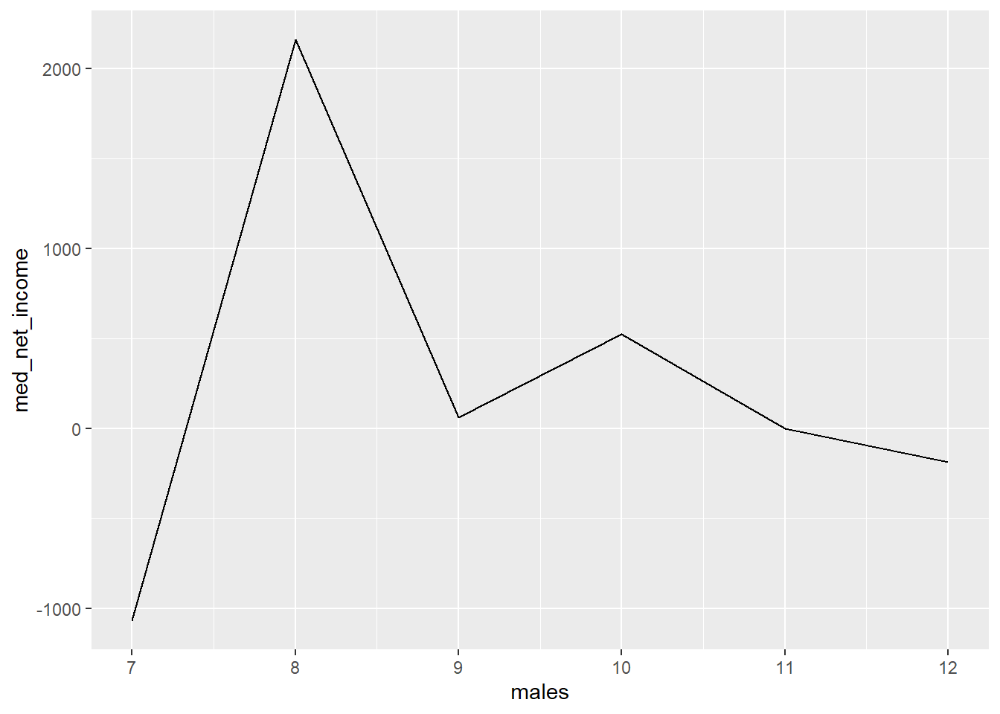

::: {.cell}

```{.r .cell-code}
library(tidyverse)
```
:::

::: {.cell}

```{.r .cell-code}
people <- read_csv("C:\\Users\\derek\\Downloads\\registration_cleaned_sp22_f23_joined_with_business_name (2).csv")

businesses <- read_csv("C:\\Users\\derek\\Downloads\\IBC Historical Data.csv")

people <- people %>% 
  drop_na("Business me")

business <- businesses %>% 
  drop_na("Company Name")
```
:::

::: {.cell}

```{.r .cell-code}
df <- left_join(people, business, by = c("Business me" = "Company Name"))
```
:::

::: {.cell}

```{.r .cell-code}
gender <- df %>%
  group_by(`Business me`) %>%
  mutate(
    females = sum(`Gender` == 'Female', na.rm = TRUE), 
    males = sum(`Gender` == 'Male', na.rm = TRUE)
  )
```
:::

::: {.cell}

```{.r .cell-code}
dfdf <- gender %>%
  group_by(females) %>%
  mutate(females = as.factor(females))

dfdf1 <- gender %>%
  group_by(males) %>%
  mutate(males = as.factor(males))

df1 <- gender %>%
  group_by(females) %>%
  summarise(
    med_net_income = median(`Net Income`, na.rm = TRUE), 
    avg_net_income = mean(`Net Income`, na.rm = TRUE), 
    sum_net_income = sum(`Net Income`, na.rm = TRUE)
  )

df2 <- gender %>%
  group_by(males) %>%
  summarise(
    med_net_income = median(`Net Income`, na.rm = TRUE), 
    avg_net_income = mean(`Net Income`, na.rm = TRUE), 
    sum_net_income = sum(`Net Income`, na.rm = TRUE)
  )
```
:::

::: {.cell}

```{.r .cell-code}
ggplot(gender, aes(x=females)) +
  geom_boxplot()
```

::: {.cell-output-display}
{width=672}
:::
:::

::: {.cell}

```{.r .cell-code}
ggplot(dfdf, aes(x=females, y=`Net Income`)) +
  geom_boxplot()
```

::: {.cell-output-display}
{width=672}
:::
:::

::: {.cell}

```{.r .cell-code}
ggplot(dfdf1, aes(x=males, y=`Net Income`)) +
  geom_boxplot()
```

::: {.cell-output-display}
{width=672}
:::
:::

::: {.cell}

```{.r .cell-code}
ggplot(gender, aes(x=males)) +
  geom_boxplot()
```

::: {.cell-output-display}
{width=672}
:::
:::

::: {.cell}

```{.r .cell-code}
ggplot(df1, aes(x=females, y = med_net_income)) +
  geom_line()
```

::: {.cell-output-display}
{width=672}
:::
:::

::: {.cell}

```{.r .cell-code}
ggplot(df1, aes(x=females, y = avg_net_income)) +
  geom_line()
```

::: {.cell-output-display}
{width=672}
:::
:::

::: {.cell}

```{.r .cell-code}
ggplot(df1, aes(x=females, y = sum_net_income)) +
  geom_line()
```

::: {.cell-output-display}
{width=672}
:::
:::

::: {.cell}

```{.r .cell-code}
ggplot(df2, aes(x=males, y = med_net_income)) +
  geom_line()
```

::: {.cell-output-display}
{width=672}
:::
:::

::: {.cell}

```{.r .cell-code}
ggplot(df2, aes(x=males, y = avg_net_income)) +
  geom_line()
```

::: {.cell-output-display}
{width=672}
:::
:::

::: {.cell}

```{.r .cell-code}
ggplot(df2, aes(x=males, y = sum_net_income)) +
  geom_line()
```

::: {.cell-output-display}
{width=672}
:::
:::

::: {.cell}

```{.r .cell-code}
businesses$Smstr <- factor(businesses$Smstr, levels = c("Fall", "Winter", "Spring"))

food <- businesses %>% 
  filter(Category == "Food/Drink") %>% 
  group_by(Smstr)
```
:::

::: {.cell}

```{.r .cell-code}
ggplot(food, aes(x=Smstr, y=`Net Income`)) +
  geom_boxplot()
```

::: {.cell-output-display}
{width=672}
:::
:::
